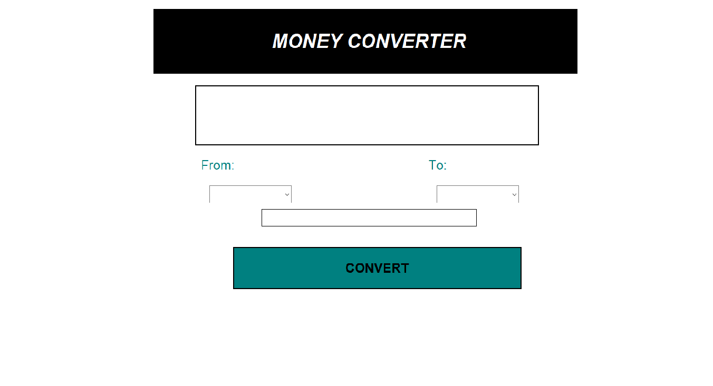
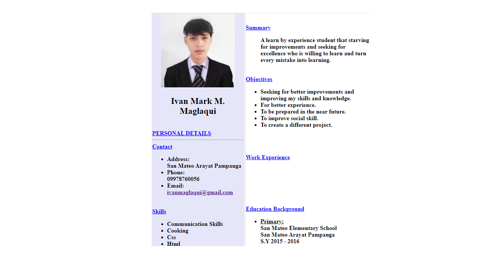

#Portfolio

Welcome to my personal portfolio website! This project showcases my skills, projects, and contact information.

## Table of Contents
- [About the Project](#about-the-project)
- [Technologies Used](#technologies-used)
- [Project Structure](#project-structure)
- [Features](#features)
- [Getting Started](#getting-started)
- [Contact](#contact)
- [License](#license)

## About the Project

This portfolio website is a personal project created to display my skills and projects as a second-year Information Systems student. It includes sections about me, my skills, projects I've worked on, and ways to get in touch with me.

## Technologies Used

- HTML
- CSS
- Boxicons

## Project Structure

The project consists of the following main files and directories:
- `index.html`: The main HTML file containing the structure of the portfolio website.
- `CSS/style.css`: The CSS file for styling the portfolio website.
- `assets/`: Directory containing images and other media files used in the website.
- `project1/`: Directory containing the first project.
- `project2/`: Directory containing the second project.
- `project3/`: Directory containing the third project.

## Features

- **Home Section**: A welcome message with my name and a link to download my CV.
- **About Section**: Information about me, my education, interests, and skills.
- **Projects Section**: A gallery of my projects with descriptions and links to view more details.
- **Contact Section**: A form to get in touch with me via email.

## Getting Started

To view the website, simply open the `index.html` file in your web browser.

### Prerequisites

Make sure you have a web browser installed (e.g., Chrome, Firefox).

### Installation

```bash
# Clone this repository
$ git clone https://github.com/maglaquiivan/portfolio.git

# Navigate to the project directory:
    ```bash
    cd your-repo-name
    ```

# Open index.html in your web browser to view the portfolio.
```

<br/>
<br>

## Template Instructions:

## Step 1 - STYLES

Make sure you have started the CSS compilation by running

make sure the css is connected in html

<br/>

<br/>

## Step 2 - Homepage

Go to `index.html` and fill your information, there are 6 sections:

### Header of Homepage

- On `logo`, Add your own Image, Better if the background of the image is transparent so the background can match the theme color. 
- On `.header__logo-sub`, Add your own Name.

```html
<!-- **** Header of Homepage **** -->
  <header class="header">
    <div>
        <a href="https://www.facebook.com/maglaquiivan" class="logo"></a>
    </div>   
        <nav class="navbar">
            <a href="#home">Home</a>
            <a href="#about">About</a>
            <a href="#project">Projects</a>
            <a href="#contact">Contact</a>
        </nav>
    </header>
    <!-- END Header -->
    ```
  ```html
<!-- **** home-content Section of Homepage **** -->
<section id="home">
        <div class="home-content">
            <h3> Hello! I'm</h3><br>
            <h1>Ivan Mark M. Maglaqui</h1><br>
            <h3>Welcome to My Portfolio</h3><br>
               <a href="project3/Resume-Maglaqui.html"> <button class="btn">Download CV</button></a>
               <marquee><div class="social">
                <a href="https://www.facebook.com/maglaquiivan"><i class='bx bxl-facebook-circle' ></i></a>
                <a href="https://www.instagram.com/vanisdamn/"><i class='bx bxl-instagram' ></i></a>
                <a href="https://www.linkedin.com/in/maglaqui-ivan-mark-58a44930b/"><i class='bx bxl-linkedin-square' ></i></a>
                <a href="https://github.com/maglaquiivan"><i class='bx bxl-github' ></i></a>
            </div></marquee>
        </div>
    <div class="image">
        
        </div>

        <!-- /END Hero Section -->
  ``````html

<!-- **** About Section of Homepage **** -->
<section id="about">
        <div class="about-content">
            <h1 class="headings">About Me</h1><br>
            <h3>Get to Know Me!</h3>
            <p> Yo! I'm Ivan Mark Maglaqui, located in the Philippines.I'm currently in 2nd year college, taking Bachelor of Science in Information System at Exact Colleges Of Asia.
               I'm a Ambivert person,but the friendly one. I'm also a member of varsity chess team in the campus. I also play online games like wildrift,codm,ml,pubgm,etc.
            </p>
            <h3>SKILLS</h3><br>
        <table class="skills">
            <tr>
                <td class="btn1">HTML</a></td> 
                <td class="btn1">CSS</a></td> 
                <td class="btn1">COMMUNICATION</a></td> 
                <td class="btn1">ACTIVE LISTENING</a></td> 
                <td class="btn1">COLLABORATION</a></td> 
                <td class="btn1">ADAPTABILITY</a></td> 
                <td class="btn1">TEAMWORK</a></td> 
            </tr>
        </table> 
        </div>
    </section>

  <!-- END About Section -->
```

### Projects
```html
<!-- **** Projects Section of Homepage **** -->
<section id="project">
        <div class="about-project">
            <h1 class="headings">Projects</h1>
            <div class="project-list">
                <div class="work">
                    
                    <div class="layer">
                        <h3>2023 CALENDAR</h3>
                        <p>This one is my  final work in "COMPUTER PROGRAMMING 1" when i was in first year college.Built using HTML in notepad.</p>
                        <a href="project1/1January.HTML"><i class='bx bx-link-external'></i></a>
                    </div>
                </div>
                <div class="work">
                    
                    <div class="layer">
                            <h3>MONEY CONVERTER</h3>
                            <p>This one is my final work in "COMPUTER PROGRAMMING 2" when i was in first year college.Built in using Python in vscode.</p>
                            <a href="project2/Currency.exe"><i class='bx bx-link-external'></i></a>
                        </div>
                </div>
                <div class="work">
                    
                    <div class="layer">
                            <h3>RESUME</h3>
                            <p>This one is my work in "WEB PROGRAMMNG".Built in using HTML in sublime.</p>
                            <a href="project3/Resume-Maglaqui.html"><i class='bx bx-link-external'></i></a>
                        </div>
                </div>
            </div>
        </div>
    </section>
    <!-- END Projects Section -->
```

### Contact Section
```html
<!-- **** Contact Section of Homepage **** -->
<section id="contact">
        <h1 class="contact-me">Contact Me</h1>
        <h3>Get in touch</h3>

    <form action="https://api.web3forms.com/submit" method="POST">
        <div class="input-box">   
        <input type="hidden" name="access_key" value="e1e65438-4912-474c-80ac-1b27d6bc119f">
            <input type="name" placeholder="Enter Your Name" required>
            <input type="email" placeholder="Enter Your Email">
        <textarea name="message"placeholder="Enter Your Message"></textarea>
        <button class="btn5">SEND</button>
    </div> 
    </form>
</section>
<!-- END Contact Section -->
```


### Footer Section
```html
<!-- **** Footer Section **** -->
<footer class="footer">
    <div class="social">
        <a href="https://www.facebook.com/maglaquiivan"><i class='bx bxl-facebook-circle' ></i></a>
        <a href="https://www.instagram.com/vanisdamn/"><i class='bx bxl-instagram' ></i></a>
        <a href="https://www.linkedin.com/in/maglaqui-ivan-mark-58a44930b/"><i class='bx bxl-linkedin-square' ></i></a>
        <a href="https://github.com/maglaquiivan"><i class='bx bxl-github' ></i></a>
    </div>

    <ul class="list">
        <li> <a href="#contact">FAQS</a></li>
        <li> <a href="#about">About Me</a></li>
        <li> <a href="#contact">Contact</a></li>
        <li> <a href="#contact">Feedback</a></li>
    </ul>
<p class="copyright">Copyrights 2024 Ivan Mark M. Maglaqui | All rights Reserved.</p>
</footer>
<!-- END Footer Section -->
## Step 3 - Project Page

Each project will have its own Page. The project page will have important details about the project like the Project Title, Description, Technologies, Project Links, etc.

<br>

---

<br>
## Deployment 

Once you have done with your setup. You need to put your website online!

I highly recommend to use [Netlify](https://netlify.com) to achieve this on the EASIEST WAY

Whenever you wanna host a new site on Netlify. You will need to press the **Create New Site** button from the Netlify's dashboard once you login into Netlify.

Once you press the **Create Site Button** then you will have to follow the 3 steps:

1. You will have to select your Github account.

2. Then select the Repository which you wanna host, in this case its your Portfolio website ( Clone of Dopefolio )

3. In the 3rd step, you will have to modify the **Site settings and deploy**, keep everything as it is but just make sure to modify the **Build command** and set its value to **npm run build** and then modify the **Publish directory** and set its value to **/** as shown in the  **image** below


  